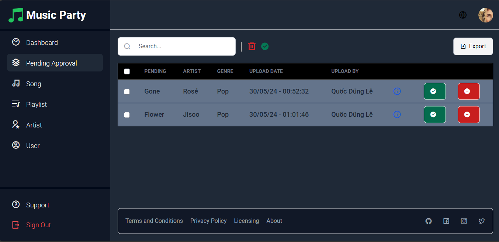
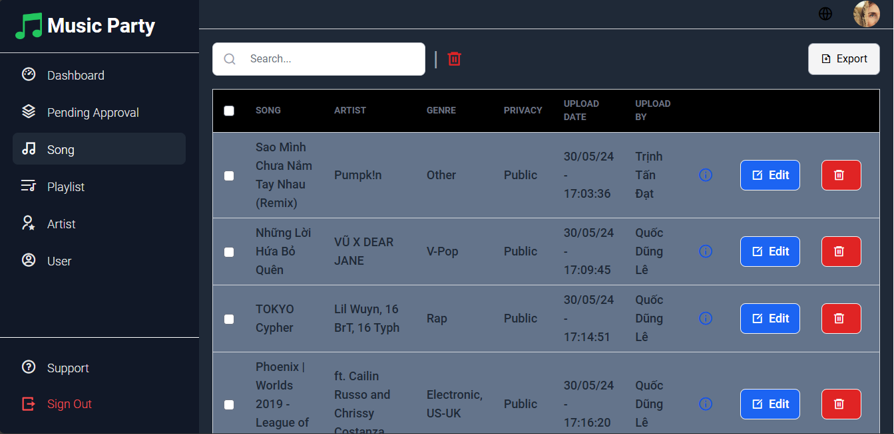
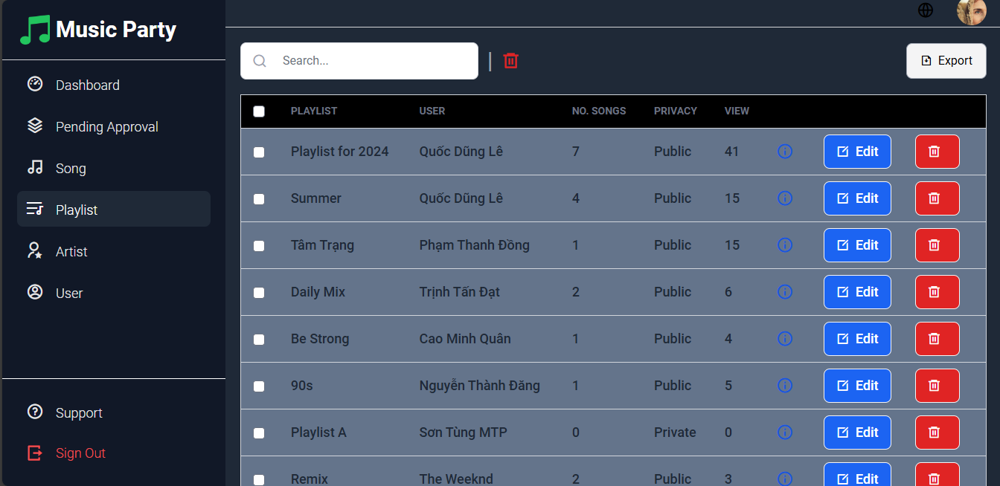
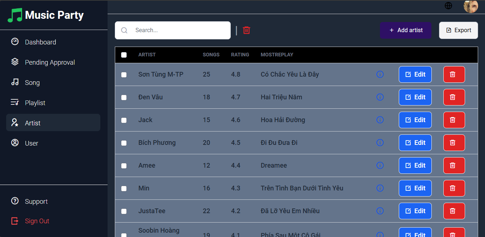
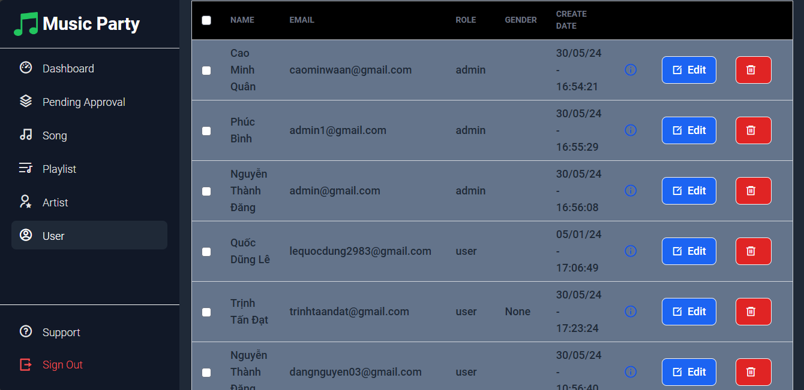

<h1 align="center">
  <br>
  
  <br>
  <br>
  🎼 Music Party Admin Dashboard 🎼
  <br>
  <br>
</h1>

<h4 align="center">Music Party Admin Dashboard allows administrators to efficiently manage music content and user interactions on the Music Party platform.</h4>

<p align="center">
  <a href="https://react.dev">
    
  </a>
  <a href="https://tailwindcss.com">
    
  </a>
  <a href="https://nodejs.org">
    
  </a>
</p>

<p align="center">
  <a href="#introduction">Introduction</a> •
  <a href="#get-started">Get Started</a> •
  <a href="#features">Features</a> •
  <a href="#technologies">Technologies</a> •
  <a href="#contributors">Contributors</a>
</p>

<h2 id="introduction">Introduction👋</h2>
<p>
  The Music Party Admin Dashboard is an essential tool for managing the Music Party platform. It provides administrators with the ability to oversee and control various aspects of the service, ensuring a smooth and enjoyable experience for all users. The dashboard includes features for managing pending public tracks, songs, playlists, artists, and users.
</p>

<h2 id="get-started">Get Started⚙️</h2>
<ol>
  <li>Open a terminal on your machine.</li>
  <li>Navigate to the directory where you want to clone the repository.</li>
  <li>Run the following command to clone the repository:</li>
</ol>

```bash
git clone https://github.com/Trinh-Tan-Dat/party-music-admin.git
```
<ol start="4">
  <li>Once the repository is cloned, navigate into the project directory using the following command:</li>
</ol>

```bash   
cd music-party-admin
```
<ol start="5">
  <li>Install the necessary dependencies by running the following command:</li>
</ol>

```bash
npm install
```

<ol start="6">
  <li>Finally, start the project with the following command and begin managing the Music Party platform! 🎉🎉🎉</li>
</ol>

```bash
npm start
```
<h2 id="features">Features💻</h2>
The Music Party Admin Dashboard provides several key features to ensure efficient management of the platform:

#### Pending Tracks Management

<ul>
  <li><strong>Review and Approve/Reject Tracks:</strong> Admins can review detailed information about each track, listen to previews, and decide whether to approve or reject them for publication on the platform.</li>
  <li><strong>Track Metadata Verification:</strong> Ensure that all necessary metadata (e.g., title, artist, album, genre) is complete and accurate before approval.</li>
  <li><strong>Bulk Actions:</strong> Approve or reject multiple tracks at once to streamline the management process.</li>
</ul>

<p align="center">
  
</p>

#### Songs Management

<ul>
  <li><strong>Add New Songs:</strong> Easily upload new tracks, fill in all relevant details, and publish them on the platform.</li>
  <li><strong>Edit Existing Tracks:</strong> Update information or replace audio files for existing tracks to keep the catalog current.</li>
  <li><strong>Remove Tracks:</strong> Delete songs that are no longer relevant or have been flagged for removal.</li>
  <li><strong>Categorize Tracks:</strong> Assign genres and tags to tracks for better organization and searchability.</li>
</ul>

<p align="center">
  
</p>

#### Playlists Management

<ul>
  <li><strong>Create Playlists:</strong> Admins can create new playlists, adding descriptions and selecting cover images.</li>
  <li><strong>Update Playlists:</strong> Modify existing playlists by adding or removing tracks, changing the order of songs, and updating playlist information.</li>
  <li><strong>Delete Playlists:</strong> Remove playlists that are no longer needed or have become outdated.</li>
  <li><strong>Feature Playlists:</strong> Highlight certain playlists on the platform's main page to promote specific collections or themes.</li>
</ul>

<p align="center">
  
</p>

#### Artists Management

<ul>
  <li><strong>Add New Artists:</strong> Introduce new artists to the platform by creating profiles with bios, photos, and links to social media.</li>
  <li><strong>Update Artist Profiles:</strong> Keep artist information up to date, including new releases, biography changes, and profile images.</li>
  <li><strong>Organize by Popularity:</strong> Sort and display artists based on their popularity, recent activity, or alphabetical order.</li>
  <li><strong>Manage Collaborations:</strong> Link artists who have collaborated on tracks to enhance discoverability.</li>
</ul>

<p align="center">
  
</p>

#### Users Management

<ul>
  <li><strong>View User Information:</strong> Access detailed user profiles, including listening history, playlists created, and user preferences.</li>
  <li><strong>Manage User Privileges:</strong> Assign roles and permissions to users, such as granting admin rights or restricting access to certain features.</li>
  <li><strong>Monitor User Activity:</strong> Track user engagement and activity to identify trends and improve user experience.</li>
  <li><strong>Handle User Reports:</strong> Respond to user reports and manage flagged content to maintain a safe and enjoyable environment.</li>
</ul>

<p align="center">
  
</p>

<h2 id="technologies">Technologies🤖</h2>
The project leverages powerful web technologies to deliver a high-performance, responsive, and efficient admin dashboard.

<ul>
  <li><strong>React:</strong> A JavaScript library for building user interfaces, ensuring a dynamic and responsive user experience.</li>
  <li><strong>Tailwind:</strong> A utility-first CSS framework that allows for rapid UI development with customizable design elements.</li>
  <li><strong>NodeJS:</strong> A JavaScript runtime that provides the backend infrastructure needed for server-side operations and API handling.</li>
</ul>

<h2 id="domain">Deployment ✈</h2>
The Music Party Admin Dashboard is deployed using Vercel, ensuring a seamless and scalable hosting solution.

<a href="https://music-party-admin.vercel.app/">Access the deployed application here</a>

<h2 id="contributors">Contributors🤝</h2>
<a href="https://github.com/Trinh-Tan-Dat">
  
</a>
<a href="https://github.com/cmwuaan/music-party-frontend/graphs/contributors">
  
</a>
<p>Made with <a href="https://contrib.rocks">contrib.rocks</a>.</p>

